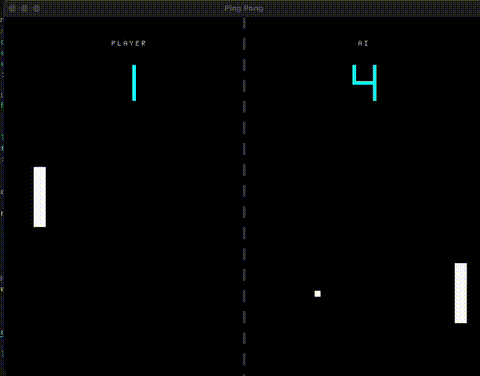

# Ping Pong Engine

A lightweight 2D game engine built in Rust specifically designed for creating a classic Ping Pong game. This project demonstrates modular game architecture, real-time rendering, and game system design patterns.



## Features

- **Real-time 2D rendering** using pixel buffer manipulation
- **Modular ECS-inspired architecture** with separated components and systems
- **Smooth 60 FPS gameplay** with delta-time based movement
- **Player vs AI gameplay** with intelligent paddle behavior
- **Collision detection** between ball, paddles, and boundaries
- **Digital scoreboard** with retro 7-segment display styling
- **Configurable game parameters** through centralized config system


## Technical Implementation

**Rendering**: Custom 2D pixel buffer rendering with direct memory manipulation for optimal performance

**Input Handling**: Real-time keyboard input processing using the minifb library

**Physics**: Simple velocity-based movement with collision response and boundary constraints

**AI**: Reactive AI opponent that tracks ball position with realistic movement limitations

**Architecture Pattern**: Entity-Component-System inspired design for maintainable and extensible code

## Controls

- **Arrow Keys** or **WASD**: Move player paddle up/down
- **Escape**: Exit game

## Dependencies

- `minifb`: Window creation and input handling
- `winit`: Cross-platform window management

## Getting Started

### Prerequisites

- Rust 1.70 or later
- Cargo package manager

### Installation and Running

```bash
# Clone the repository
git clone https://github.com/jeffasante/ping_pong_engine.rust
cd ping_pong_engine

# Build and run
cargo run

# For optimized release build
cargo run --release
```

### Configuration

Game parameters can be modified in `src/engine/config.rs`:

```rust
pub struct Config {
    pub window_width: u32,      // Default: 800
    pub window_height: u32,     // Default: 600
    pub paddle_speed: f32,      // Default: 300.0
    pub ball_speed: f32,        // Default: 200.0
    pub fps_target: u64,        // Default: 60
    // ... additional styling options
}
```

## Development Notes

This project serves as a foundation for 2D game development in Rust, demonstrating:

- **Memory-safe systems programming** with Rust's ownership model
- **Performance-oriented rendering** through direct pixel manipulation
- **Clean architecture patterns** for game development
- **Real-time system constraints** and frame timing management

The modular design allows for easy extension with additional features like sound effects, particle systems, or networked multiplayer functionality.

## License

This project is created for educational and portfolio purposes.